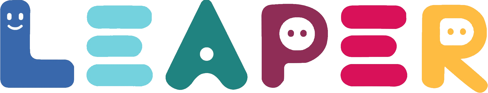

 

# Leaper: Digital Learning Platform

Leaper is a digital platform to manage learning systems.

This is the backend for the Leaper project, a basic LMS built around Nest.js and Flutter. This backend is written in Nest.js

> [!NOTE]
> This Project is Divided into two Repos. For the Front End Repo, see
> https://github.com/local-fish/Leaper

## Requirements

- [`Bun`](https://bun.sh/)
- [`MySql`](https://www.mysql.com/)

## Setup

1. Install dependencies: `bun i`

2. Configure environment: `cp .env.example .env`

3. Generate database: `bun prisma generate --schema prisma/schema.[postgresql/mysql].prisma && bun prisma db push`

## Running

Run `bun start`

## Generating Data

Note that database generation requires `DEV` to be set to true in `.env`.
This shoould only be used for development purpose.

### Sample Data

The generated sample data is contained in `sample.sql`. The configured password secret is `e8ZfczuLj1olVpCI-18X9T4mY0RB`.

### New Data

Run `bun dbtest/gen2.ts`. Make sure to clean the database first.
If you do not wish to generate S3 files, set `S3_DEV_NOGEN` environment to `true`, e.g. `S3_DEV_NOGEN=true bun dbtest/gen2.ts`.

User examples:
- Student: `andrew.p@example.com`, password: `fish`
- Teacher: `john@example.com`, password: `john`

### Wiping Data

Run `bun dbtest/wipe.ts`.

### Listing Data

Run `bun dbtest/test.ts`.
